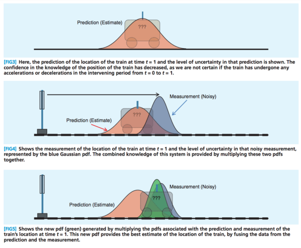

#

Un modelo estado espacio consiste en:

<ul>
<li> Una ecuación de Medida que relaciona los datos observados con un estado m-dimensional, no observado, $\alpha_t$.
        \begin{equation}
            x_t = z_t \alpha_t + \delta_t + \varepsilon_t
        \end{equation}
        donde $z_t$ es $T \times m$, y $\varepsilon_t \sim iid(0,\nu_t)$ </li>
<li> Una ecuación de transición que describe la evolución en el tiempo de $\alpha_t$. 
        \begin{equation}
            \alpha_t = D_t \alpha_{t-1} + c_t + R_t \eta_t
        \end{equation}
        donde $D_t$ es una matriz de transición $m \times m$, y $\eta_t \sim iid(0,Q_t)$ </li>
 
#

Las matrices $z_t, \delta_t, \nu_t, D_t, c_t, R_t, Q_t$ se denominan matrices del sistema y son no-estocásticas.
Si estas matrices no dependen de $t$, el sistema estado-espacio se considera invariante.

Si $x_t$ es estacionario el sistema es invariante.

##

En la mayoría de los casos se supone además que $\varepsilon_t$ es independiente de $\eta_t$, tal que $E[\varepsilon_t \eta_t] = 0 \quad \forall s,t$

#

Lo ultimo que necesitamos para definir la representación estado-espacio es el comportamiento del vector de valores iniciales:
    \begin{equation}
        \alpha_0 \sim N(a_0,P_0)
    \end{equation}
    donde $E[\varepsilon_t \alpha_0'] = 0$, $E[\eta_t \alpha_0'] = 0$

#

Si el modelo estado-espacio es estacionario (débil) entonces el vector de estado, $\alpha_t$, es estacionario (débil).

Podemos entonces calcular la media no condicional, como:
    \begin{equation}
        E[\alpha_t] = D E[\alpha_{t-1}] + c 
    \end{equation}

#

 Despejando,
        \begin{equation}
        E[\alpha_t] = (I_m - D)^{-1} c 
    \end{equation}
    y $a_0=E[\alpha_t]$

#

Podemos calcular la varianza haciendo uso de algunas propiedades de Álgebra Lineal,
    \begin{align*}
        P_0 & = Var(\alpha_t) = Var[D \alpha_{t-1} + c_t + R_t \eta_t] \\
        P_0 & = D \ Var(\alpha_{t-1}) D' + Var(c_t) + R \ Var(\eta_t) R'\\
        P_0 & = D P_0 D' +  R Q R' \\
    vec(P_0) & = vec(D P_0 D') +  vec(R Q R')
    \end{align*}
    
## Propiedades Álgebra Lineal

##

<ul>
<li> El operador $vec$ vectoriza la matriz tomando cada columna en orden y poniéndola al final de la primera columna.</li>
<li> $vec(ABC) = C' \otimes A * vec(B)$, donde $\otimes$ denota el producto Kronecker.</li>
    
##

E.g., Sea $A=\begin{bmatrix}
 a_{1,1} & a_{1,2} \\ 
 a_{2,1} & a_{2,2} 
\end{bmatrix}$ y
$B=\begin{bmatrix}
 b_{1,1} & b_{1,2} \\ 
 b_{2,1} & b_{2,2} 
\end{bmatrix}$
$vec(A) =\begin{bmatrix}
 a_{1,1} \\ 
 a_{2,1} \\ 
 a_{1,2} \\
 a_{2,2} 
\end{bmatrix}$ 
$A \otimes B = \begin{bmatrix}
 a_{1,1} B & a_{1,2} B \\ 
 a_{2,1} B & a_{2,2} B 
\end{bmatrix}$

#

Usando las propiedades del operador $vec$, tenemos
        \begin{align*}
         vec(P_0) & = D \otimes  D' \ vec(P_0) +  vec(R Q R') \\
         vec(P_0) & = (I_m -  D \otimes  D')^{-1}   vec(R Q R')
    \end{align*}
donde $vec(P_0)$ es un vector de tamaño $m^2 \times 1$, del cual se puede recuperar la matriz original.
    

# Estado-Espacio - Ejemplo

#

No existe una representación estado-espacio única para los modelos ARMA. Veamos una posible representación para un modelo AR(2) con constante,
    \begin{equation}
        x_t = \delta + \phi_1 x_{t-1} + \phi_2 x_{t-2} + \varepsilon_t
    \end{equation}

#

Definimos $\alpha_t = (x_t,x_{t-1})'$, así la ecuación de transición es entonces,
    \begin{align*}
     \alpha_t&  = D \alpha_{t-1} + c + R \eta_t \\
        \begin{bmatrix}
            x_t \\
            x_{t-1}
        \end{bmatrix} & = \begin{bmatrix}
            \phi_1 & \phi_2 \\
            1 & 0
        \end{bmatrix} \begin{bmatrix}
            x_{t-1} \\
            x_{t-2}
        \end{bmatrix}  + \begin{bmatrix}
           \delta \\
            0
        \end{bmatrix} + \begin{bmatrix}
            1 \\
            0
        \end{bmatrix} \eta_t
    \end{align*}

#

Y definiendo $x_t = [1, \ 0] \alpha_t$. La ecuación de medida sería entonces,
    \begin{align*}
           x_t = z_t \alpha_t + \delta_t + \varepsilon_t \\
           x_t = [1, \ 0] \alpha_t + 0 + 0
    \end{align*}
La distribución inicial del vector de estado,
    \begin{equation}
        a_0 = \begin{bmatrix}
            \frac{\delta}{1 - \phi_1 - \phi_2} \\
            \frac{\delta}{1 - \phi_1 - \phi_2} 
        \end{bmatrix}
    \end{equation}

#

Y la varianza,
\begin{equation}
        vec(P_0) = \begin{bmatrix}
            1 - \phi_1^2 & - \phi_1\phi_2 & -\phi_1\phi_2 & - \phi_2^2 \\
            - \phi_1 & 1 & - \phi_2 & 0 \\
            - \phi_1& - \phi_2 & 1 & 0 \\
            -1 & 0 & 0 & 1
\end{bmatrix}
\end{equation}

# Filtro de Kalman

# 

Kalman (1960) propuso un conjunto de ecuaciones recursivas que sirven para determinar la estimación óptima del vector de estado $\alpha_t$, dado el conjunto de información disponible $\Omega_t$.

Este filtro fue usado originalmente para fines militares, diseñando sistemas de navegación para los submarinos de la marina de EEUU, al igual que fue usado para la navegación del programa Apolo de la NASA.

En economía ha sido utilizado para hacer predicción, al igual que imputación de *missing data*.

#

#

#
Bajo esta idea podemos desarrollar el filtro, sea $a_t = E[\alpha_t | \Omega_t]$ el estimador óptimo de $\alpha_t$ basado en $\Omega_t$

Entonces, $P_t = E[(\alpha_t - a_t)(\alpha_t - a_t)'| \Omega_t]$ es el ECM

# Ecuaciones de Predicción

#

Dados $a_{t-1}$ y $P_{t-1}$, obtenemos que los predictores óptimos son,
    \begin{equation}
        a_{t|t-1} = E[\alpha_t | \Omega_{t-1}] = D_t a_{t-1} + c_t
    \end{equation}
Y el ECM asociado,
    \begin{equation}
        P_{t|t-1} = E[(\alpha_t - a_t)(\alpha_t - a_t)'| \Omega_{t-1}] = D_t P_{t-1} D_t' + R_t Q_t R_t'
    \end{equation}

#

El predictor óptimo para $x_t$ con el conjunto de información $\Omega_{t-1}$ es entonces,
    \begin{equation}
        x_{t|t-1} = z_t a_{t|t-1} + \delta_t
    \end{equation}
Y el error de predicción,
    \begin{equation}
     v_t = x_t -  x_{t|t-1} =  x_t- z_t a_{t} + \delta_t = z_t (\alpha_t - a_{t|t-1}) + \varepsilon_t
    \end{equation}
    

# Ecuaciones de Actualización

#

Una vez hay una nueva realización de $x_t$, debemos actualizar la predicción, $a_{t|t-1}$, y la matriz de ECM. Para esto usamos,
    \begin{align*}
          a_{t} & = a_{t|t-1} +  P_{t|t-1} z_t'F_t^{-1} (x_t - z_t a_{t|t-1} - \delta_t) \\
               & = a_{t|t-1} +  P_{t|t-1} z_t'F_t^{-1} v_t \\
         P_t & = P_{t|t-1} - P_{t|t-1} z_t'F_t^{-1} z_t P_{t|t-1}
    \end{align*}
    

#
$a_t$ es la estimación filtrada de $\alpha_t$, $P_t$ es la matriz del ECM de esta estimación, y $F_t$ es el estimador óptimo para el ECMP

#

Kalman propuso hacer la estimación usando toda la muestra,
    \begin{equation}
         a_{t|T} = E[\alpha_t | \Omega_{T}]  = a_{t|t} + J_t ( a_{t+1|T} - a_{t+1|t})
    \end{equation}
    donde $J_t = P_{t|t} D_t' P_{t|t-1}^{-1}$

#

Con su ECM asociado, la prueba esta en Hamilton (1994), 
        \begin{equation}
         P_{t|T} =  P_{t|t} + J_t ( P_{t+1|T} - P_{t+1|t}) J_t'
    \end{equation}
    
#

El estimador presentado es llamado el **Suavizador de Kalman** y corresponde con una estimación del vector de estado que hace uso de la información disponible usando toda la muestra y realizar la predicción óptima en cada momento del sistema.

