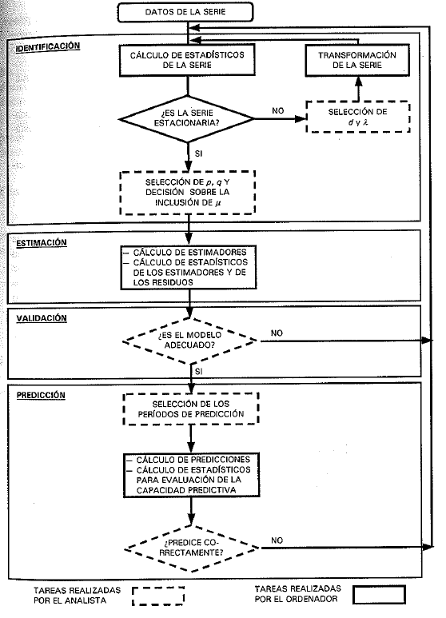

# Elaboración de un modelo ARIMA

#

 

# Identificación

En las clases anteriores hemos hablado del supuesto de estacionariedad como algo deseable para las series de tiempo con las que trabajamos, esto es debido a que en general los modelos que veremos en clase no funcionan para procesos no-estacionarios. 

# Procesos No-estacionario

La no-estacionariedad de una serie genera problemas de estimación de los parámetros. Ahora discutiremos tres de ellos
<ul>
<li> El parámetro del proceso AR(1) es sesgado hacia cero.</li>
<li> El parámetro puede tener una distribución no-normal.
<li> Obtenemos <a href="https://tylervigen.com/spurious-correlations">regresiones espurias.</a> 
</ul>

#

Por este motivo el primer paso para identificar el modelo que vamos a usar, es asegurarnos que la serie que vamos a usar es estacionaria.

# Pruebas de Raíces unitarias

Se han diseñado diferentes pruebas estadísticas para asegurase de la estacionariedad de la serie. A continuación veremos cuatro de las pruebas más usadas:

<ul>
<li> Prueba de Dickey-Fuller
<li> Prueba de Dickey-Fuller aumentada
<li> Prueba de Phillips-Perron
<li> Prueba KPSS
</ul>

    
# Prueba de Dickey-Fuller

#

Dickey y Fuller (1979) consideraron el modelo AR(1),

\begin{equation}
    x_t = \phi x_{t-1} + \varepsilon_t 
\end{equation}

Cuando $\phi =1$ este proceso tiene raíz unitaria y se vuelve un paseo aleatorio.

Si substraemos $x_{t-1}$ de ambos lados, obtenemos

\begin{equation}\label{df}\tag{*}
    \Delta x_t = (\phi - 1) x_{t-1} + \varepsilon_t
\end{equation}

Así, para testear la hipótesis de raíz unitaria, podemos testear que el coeficiente de $x_{t-1}$ en la ecuación (*) sea igual a cero, contra la alternativa que es menor a cero
    
#

<ul>
<li> La regresión (*) es conocida como una regresión des-balanceada ya que la variable dependiente es I(0). i.e. estacionaria, y la variable independientes es I(1), i.e. integrada de orden 1, bajo la hipótesis nula.</li>
<li> Bajo la hipótesis alternativa, ambas variables son estacionarias volviendo la regresión balanceada de nuevo.</li>
</ul>

#

<ul>
<li> La forma obvia de testear la hipótesis de raíz unitaria en la ecuación (*) es usando el estadístico t para probar su significancia.</li>
<li> Sin embargo, el parámetro $\phi - 1$ de esta ecuación no sigue una distribución normal, por lo cual p-values derivados de este supuesto estarían erróneos.</li>
<li> MacKinnon (1996) derivo las probabilidades asociadas a las distribuciones de este parámetro a través de simulaciones. Estos valores son los que reportan la mayoría de paquetes estadísticos.</li>
</ul>

#

Además de la ecuación (*), D-F también desarrollaron el método para casos con constante, i.e.

\begin{equation}\label{df2}\tag{+}
    \Delta x_t = \delta + (\phi - 1) x_{t-1} + \varepsilon_t
\end{equation}

y tendencia 

\begin{equation}\label{df3}\tag{^}
    \Delta x_t = \delta + \alpha t +  (\phi - 1) x_{t-1} + \varepsilon_t
\end{equation}

MacKinnon (1996) también estimo las probabilidades asociadas a los parámetros de (+) y (^). En economía por lo general testeamos usando (+)

# Prueba de Dickey-Fuller Aumentado

#

Los resultados anteriores parten de un modelo AR(1), Dickey (1984) extendió estos resultados para proceso AR(p), de forma tal que lo podemos escribir como,

\begin{align}
   \Delta  x_t & = \beta  x_{t-1} + \phi_1'\Delta x_{t-1} +  \phi_2' \Delta x_{t-2} + \dots \\
   & + \phi_{p-1}' \Delta x_{t-(p-1)} +  \varepsilon_t
\end{align}

donde $\beta$ sigue la misma distribución que el parámetro de (*). También se puede extender para las ecuaciones (+) y (^)

# Prueba de Phillips-Perron

#
<ul>
<li> Phillips y Perron (1988) desarrollaron un test basado en la ecuación (*), en el cual no se estima la correlación serial como en (++), pero utilizan un estimador no-parametrico consistente para heteroscedastidad y auto-correlación, a la Newey-West.  
<li> Este estimador sigue la misma distribución que D-F por lo cual los valores de MacKinnon (1996) pueden ser utilizados.</li>
<li> Sin embargo, Schwert (1989), y Perron y Ng (1996) mostraron que este estimador funciona peor que el D-F aumentado en muestras finitas, por lo cual D-F aumentado tiende a ser preferido.</li>
</ul>

# Prueba KPSS

#

<ul>
<li> D-F y PP tienen como hipótesis nula la existencia de raíz unitaria. Estos test tienen el problema que carecen de poder para rechazar, por lo cual tienden a encontrar raíces unitarias cuando estas no existen.</li>
<li> Kwiatkowski, Phillips, Schimdt and Shin (1992) crearon un test donde la hipótesis nula es I(0), i.e. la serie es estacionaria.</li>
</ul>

#

Este test es basado en que si la serie es estacionaria y la diferenciamos una vez se vuelve de orden I(-1).
 
El estadístico considerado es entonces:
    \begin{equation}
        \hat{\eta}_{\mu} = \frac{1}{n^2 s_{nl}^2} \sum_{t=1}^n S_{t}^2
    \end{equation}
    
donde, $s_{nl}^2$ es un estimador consistente de $\sigma^2$ y $S_t = \sum_{s=1}^t (x_s - \bar{x})$

# Transformación Box-Cox

#

Box-Cox (1964) estudiaron el caso de series en las cuales la varianza cambia a través del tiempo y diferenciar la serie no desaparece este comportamiento. Ellos definieron una transformación instantánea, i.e. no están involucrados varios periodos de tiempo, que se define como,

\begin{equation}
    x_t^\lambda = \left\{ \begin{matrix}
\frac{x_t^\lambda - 1 }{\lambda} & \lambda \neq  0 \\ 
\ln x_t & \lambda = 0
\end{matrix} \right.
\end{equation}

# Identificación Serie Estacionaria

Una vez nos aseguramos que la serie es estacionaria (débil) podemos proceder a escoger el modelo que deseamos estimar. Para esto haremos uso de algunas funciones y gráficas que pueden dar indicios del comportamiento de la serie.  

# FACE

#

Si tenemos una muestra del proceso $x_t$, $t=1,2,3,\dots,n$ de un procesos ARMA de orden (posiblemente) desconocido, podemos calcular la función de auto-correlación de orden $j$ como

\begin{equation}\
    \hat{\rho_j} = \frac{\hat{\gamma_j}}{\hat{\gamma_0}}
\end{equation}

Como vimos anteriormente, en un proceso AR esta desciende lentamente y en un proceso MA deberíamos ver que la FACE sea cercana a cero después del orden de auto-correlación del p.g.d. 

#

También es importante ver la distribución de este estimador $\hat{\rho_j}$. Bajo el supuesto de $\rho_j=0$, Anderson (1942) demostró que $\hat{\rho_j}$ se distribuye normal con,  

\begin{align}
    E(\hat{\rho_j}) & \simeq  0 \\
    Var(\hat{\rho_j}) & \simeq \frac{1}{N} \sum_{i = -\infty}^{\infty} (\rho_i^2 + \rho_{i+j}\rho_{i-j} + 2 \rho_i^2 \rho_j^2)
\end{align}

# FACPE

#

Si tenemos una muestra del proceso $x_t$, $t=1,2,3,\dots,n$ de un procesos ARMA de orden (posiblemente) desconocido, podemos calcular la función de auto-correlación parcial de orden $j$, $\rho_j^j$ como

\begin{equation}\label{eq:facep}
    x_t = \delta^j + \rho_1^j x_{t-1} + \dots + \rho_j^j x_{t-j} + \varepsilon_t
\end{equation}

El superíndice $j$ aparece en todos los coeficientes para mostrar que todos los coeficientes, no solo el ultimo, depende de $j$

#

<ul>
<li> Podemos calcular el FACPE hasta orden $J$ estimando la regresión para $j=1,2,\dots,J$ y retener solo el $\hat{\rho}_j^j$ estimado para cada $j$.</li>
<li> Para un proceso AR(p) la FACPE $j$ para todos los $j>p$ sera cercana a 0.</li>
<li> Para un proceso MA(q) la FACPE descenderá exponencialmente, debido a que como vimos anteriormente podemos expresar los modelos MA como AR($\infty$).</li>
</ul>

## Otros métodos

##

Otro método para estimar la FACPE es haciendo uso de las ecuaciones de Yule-Walker, así

 \begin{align*}
    \begin{bmatrix}
\hat{\phi_1^j} \\ 
\hat{\phi_2^j} \\
\vdots \\
\hat{\phi_j^j}
\end{bmatrix} & =
\begin{bmatrix}
1 & \hat{\rho_1} & \dots & \hat{\rho_{j-1}} \\ 
\hat{\rho_1} & 1 & \dots & \hat{\rho_{j-2}} \\
\vdots & \vdots & \ddots & \vdots \\
\hat{\rho_{j-1}} & \hat{\rho_{j-2}} & \dots & 1
\end{bmatrix}^{-1} 
\begin{bmatrix}
\hat{\rho_1} \\ 
\hat{\rho_2} \\
\vdots \\
\hat{\rho_j}
\end{bmatrix}
\end{align*}

 y retenemos $\hat{\phi_j^j}$ como la FACPE de orden j 

#

En un proceso AR(p), Quenouille (1946) demostró que $\hat{\rho}_j^j$ se distribuye normal con,  

\begin{align*}
    E(\hat{\rho}_j^j) & \simeq  0 \\
    Var(\hat{\rho}_j^j) & \simeq \frac{1}{N}
\end{align*}

# Ejemplos

#

$x_t = 0.6x_{t-1} + 0.2 x_{t-2} + \varepsilon_t$ Decaimiento exponencial en la face y 2 picos en la facpe

#
 

 
 

#

$x_t = \varepsilon_t - 0.6 \varepsilon_{t-1} - 0.2 \varepsilon_{t-2}$ Decaimiento exponencial en la facpe y 2 picos en la face 

#

 

 
 

#

$x_t = 0.6 x_{t-1} + \varepsilon_t  - 0.2 \varepsilon_{t-1}$

#

 

 
 

#

$x_t =  x_{t-1} + \varepsilon_t  - 0.2 \varepsilon_{t-1}  $

#

 

 
 

\begin{frame}{Identificación}

\begin{itemize}
    \item Como vimos en la gráfica anterior el FACE y FACPE también dan indicaciones sobre la estacionariedad de la serie. Si se observa que la FACE no decae y un pico cercano a uno en la FACPE es una clara indicación de no estacionariedad.
\end{itemize}

\end{frame}

