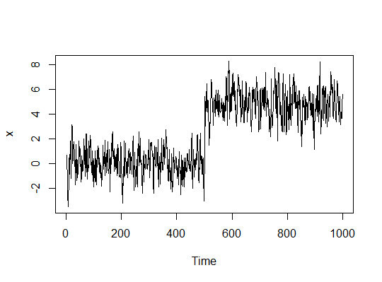

#

Entre las posibles series exógenas que se pueden incluir en este tipo de modelos, un grupo importante son aquellas variables que capturan efectos de carácter excepcional.Por ejemplo, cambios de regulación, cambios tecnológicos, cambios de políticas, huelgas, entre otros.

Para la modelación de este tipo de fenómenos Box y Tiao (1975) propusieron el  *Análisis de Intervención*

#

En este análisis de intervención consideraremos dos tipos de variables: 

  1. **Variable Impulso**:  ($I$) se define como,
    
\begin{align}
     I_t & = 1 & \text{si } t & =t^* \\
     I_t & = 0 & \text{si } t & \neq t^*
\end{align}
 
 es decir la variable toma el valor de 1 en $t^*$ y 0 en los otros periodos. 

#

Así, si en la ausencia de efectos externos podemos modelar el proceso como un ARMA,
 \begin{equation}
     \phi(L) w_t = \theta(L) \varepsilon_t
 \end{equation}

Incluyendo el impulso, tenemos,
 \begin{equation}\label{impulse}
     \phi(L) w_t = \theta(L) \varepsilon_t + \omega_0 I_t,
 \end{equation}
donde $\omega_0$ es un parámetro a estimar.

#
 
La ecuación anterior implica que $w_t$ experimenta un incremento de $\omega_0$ unidades en $t^*$. Sin embargo, en el periodo siguiente $t^* + 1$ desaparece el efecto de este impulso.

Este tipo de efectos es llamado efecto transitorios, y también es utilizado para tomar en cuenta efectos*outliers*

#

2. **Variable Escalón**: ($E_t$) se define como,

 \begin{align*}
     E_t & = 1 & \text{si } t & \geq t^* \\
     E_t & = 0 & \text{si } t & < t^*
 \end{align*}
  es decir la variable toma el valor de 1 en $t^*$ y los periodos sucesivos, y 0 en los periodos anteriores. 

#

Y como vimos con el impulso, podemos escribir el modelo como,

 \begin{equation}\label{escala}
     \phi(L) w_t = \theta(L) \varepsilon_t + \omega_0 E_t
 \end{equation}
Esta ecuación implica que $w_t$ experimenta un incremento de $\omega_0$ unidades a partir de $t^*$ 

Este tipo de efectos es llamado efecto permanente, y tiene implicaciones sobre la estacionariedad de la serie.

#

#

Esta serie presenta un escalón después de 500 observaciones, si realizamos una prueba de raíces unitarias obtenemos, $n=0.3521$ para la prueba ADF, y $p-value < 0.01$ para el KPSS.

Esto implicaría que la serie es no estacionaria, a pesar que podemos observar que antes y después del escalón la serie se comporta como una serie estacionaria.

#

Es importante anotar además que este escalón puede también representar un cambio en el p.g.d de la serie, en cuyo caso no solo necesitamos estimar el parámetro $\omega_0$, sino,
\begin{align}
     \phi_1(L) w_t & = \delta_1 + \theta_1(L) \varepsilon_t & \text{si } & t \leq t^* \nonumber\\
    \phi_2(L) w_t & = \delta_2 + \theta_2(L) \varepsilon_t & \text{si } & t > t^* \label{escala2}
 \end{align}

#

Igualmente si ignoramos este escalón nuestras predicciones serán sesgadas. Por lo tanto es necesario testear para saber si existe un escalón y en caso de este existir en donde esta.

# Punto de Quiebre - Conocido

#

Cuando conocemos el punto de quiebre, e.g. estamos examinando un cambio de política y sabemos cuando empezó a regir, podemos usar el test de Chow (1960). Este es un test $F$ de igualdad de coeficientes en el periodo $t^*$.

Estimamos por MCO la suma de cuadrados de los residuales primero sin un quiebre ($SSR_0$) y luego con un quiebre ($SSR_1$)

#

Y escribimos el estadístico para un modelo con escalón como:
  \begin{equation}
       F_T = \frac{SSR_0 - SSR_1}{SSR_1/(T-k)}
   \end{equation}

donde $F_T$es un estadístico $F$ con $k$ y $T-k$ grados de libertad, y $k$ es el numero de parámetros del modelo.

#

Y para un modelo con cambio de p.g.d.:
      \begin{equation}
       F_T = \frac{SSR_0 - (SSR_1 + SSR_2)}{(SSR_1 + SSR_2)/(T-2k)}
   \end{equation}

donde $F_T$es un estadístico $F$ con $k$ y $T-2k$ grados de libertad, y $SSR_1$ es la suma de cuadrados antes del quiebre y $SSR_2$ es la suma de cuadrados después del quiebre.

Este test es el que generalmente usan los paquetes estadísticos debido a que es más general.

# Punto de Quiebre - Desconocido

#

En general la fecha exacta de $t^*$ es desconocida. Por ejemplo, aun cuando una ley entra en funcionamiento en una fecha especifica, es posible que si es conocida con antelación se ve el efecto de esta ley antes de dicha fecha.

#

Quandt (1960) propuso un test para un solo quiebre, i.e, $p=1$, Andrews (1993) generalizo para $p>1$

El test que veremos es una simplificación del test propuesto por Andrews bajo homoscedasticidad. 

#

Para cada candidato $t'$, tendremos un $F_T(t')$, un test de igualdad de coeficientes antes y después del quiebre $t'$. Entonces, el estadístico sera
 \begin{align}
     \sup F_T = & \max_{0.15T \leq t' \leq 0.85T}  F_T(t')  \overset{d}{\rightarrow} \\
     & \sup_{0.15 \leq \lambda \leq 0.85} \frac{[B_p(\lambda) - \lambda B_p(1)]'[B_p(\lambda) - \lambda B_p(1)] }{\lambda (1-\lambda)} \nonumber
 \end{align}

donde $B_p(.)$ es un vector de movimientos Brownianos independientes

#

Noten que solo buscamos quiebres entre el percentil 15 y 85 de la muestra. Esto se debe a que como se debe comparar el proceso antes del quiebre y después del quiebre si quedan muy pocas observaciones en una de estas colas el test perderá poder.

# Múltiples quiebres

#

Cuando tenemos múltiples quiebres en nuestra muestra Bai (1997) propuso un procedimiento para encontrarlos, estimando los quiebres de forma secuencial:

 <ol>
  <li> Estimamos el quiebre que minimiza la SSR quiebre sobre toda la muestra.</li>
  <li> Partimos la muestra, y buscamos el punto de quiebre que minimiza la SSR en estas submuestras.</li>
  <li> Repetimos hasta que sea necesario.</li>
 </ol>
 
##
 
Otra opción es minimizar globalmente la SSR sobre todos los quiebres posibles.

#

Noten que hasta ahora hemos asumido que $p$ es conocido. Cuando este no es el caso Bai y Perron (1998) sugirieron el siguiente procedimiento:

<ol>
  <li> Testeamos 0 vs 1 quiebre.</li>
  <li> Si rechazamos la hipótesis nula de 0 quiebres, entonces hay al menos un quiebre.</li>
  <li> testeamos 1 vs 2 quiebres, (siguiendo el procedimiento de Bai, 1997)</li>
  <li> Si rechazamos la hipótesis nula de un quiebre, entonces hay al menos dos quiebres.</li>
  <li> Repetimos hasta que no sea posible rechazar la hipótesis nula o hasta que se alcance el numero máximo de quiebres.</li>
</ol>

#

Por lo general se impone un numero máximo posible de quiebres, este tiende ser igual a 5. Con este máximo se busca garantizar que las submuestras donde se prueban los quiebres no sean muy pequeñas.

El procedimiento anterior también se puede hacer con la hipótesis alterna de $n$ quiebres, donde $n$ es el numero máximo de quiebres, pero este tiene menor poder que $p$ vs $p+1$.

#

Finalmente, es recomendable usar el BIC y no la SSR en este procedimiento. Esto es debido a problemas de pre-testeo derivados de hacer esta prueba secuencial.

Es decir, debido a que existe un error asociado al test este se acumula al hacerse de forma secuencial.
