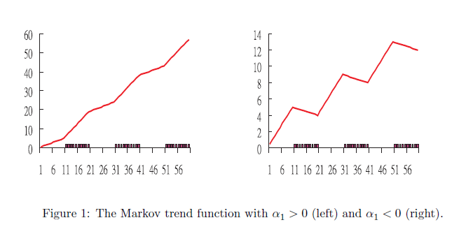

#

El *Markov Swithcing Model* propuesto por Hamilton (1989), también conocido como el modelo de cambio de régimen, es uno de los modelos no-lineales más populares de series de tiempo. Este modelo involucra múltiples ecuaciones que pueden caracterizar la serie en diferentes regímenes.

Al permitir que se cambien entre los regímenes este modelo es capaz de capturar patrones dinámicos más complejos.

#

La principal característica de este modelo es que el mecanismo de cambio de régimen es controlada por una variable de estado no observable que sigue una cadena de Markov de primer orden.

La propiedad Markoviana estipula que el valor actual de la serie depende del valor inmediatamente anterior. De esta forma, el régimen se mantiene por un periodo de tiempo aleatorio.

## Matriz de Transición

##

Una matriz de transición se define como:
    \begin{align*}
  & \; \; \; \;\;\;\;\;\;\;\;\; t+1  \\
t &        \begin{bmatrix}
 q_{1,1} & q_{1,2} & \dots  & q_{1,s} \\ 
q_{2,1} & q_{2,2} & \dots  & q_{2,s} \\ 
 \vdots & \vdots & \ddots  & \vdots \\ 
q_{s,1} & q_{s,2} & \dots  & q_{s,s}
\end{bmatrix}
    \end{align*}
donde $q_{i,j}$ es la probabilidad de pasar al estado $j$ si estaba en el estado $i$ en el periodo anterior, y $\sum_{i=1}^s q_{i,j} = 1$.

#

Veamos un modelo simple. Sea $s_t$ una variable de estado no observable que puede tener valor cero (0) o uno (1). Un modelo de cambio de régimen simple para $x_t$ puede ser:

\begin{equation}
    z_t = \left\{\begin{matrix}
\alpha_0 + \phi x_{t-1} + \varepsilon_t, & s_t=0 \\ 
\alpha_0 + \alpha_1 + \phi x_{t-1} + \varepsilon_t, & s_t=1
\end{matrix}\right.
\end{equation}

con $|\phi| < 1$ y $\varepsilon_t$ es un proceso de innovación.

#

Así tendríamos un proceso estacionario AR(1) con media $\frac{\alpha_0}{1-\phi}$ cuando $s_t=0$ y media $\frac{\alpha_0 + \alpha_1}{1-\phi}$ cuando $s_t$ cambia de cero a uno. Si $\alpha_1 \neq 0$, tenemos dos estructuras dinámicas distintas dependiendo de la variable $s_t$, la cual determina el cambio entre ambos regímenes.

#

Cuando $s_t = 0$ para $t=1,2,\dots,\tau_0$ y $s_t=1$ para $t=\tau_0+1,\tau_0+2,\dots,T$ el modelo se reduce al modelo con un cambio estructural en $t=\tau_0$.

Cuando $s_t$ es una variable indicador tal que $s_t=1$ cuando una variable $q_t$ es mayor que un umbral $c$ tenemos los modelos de transición vistos en clase.

#

Cuando $s_t$ son variables independientes con una distribución Bernoulli tenemos el modelo de cambios aleatorios de Quandt (1972). En este modelo, la realización de $s_t$ es independiente de estados pasados (y futuros) de forma tal que $x_t$ puede ser 'jumpy' (i.e. salta de un estado a otro continuamente).

#

Este modelo permite múltiples cambios y regímenes, sin embargo la variable de estado es exógena de las estructuras dinámicas del modelo.

Además, este modelo tiene la desventaja que las variables de estado son independientes a través del tiempo, por lo cual en series de tiempo esto puede ser un supuesto bastante fuerte.

#

Una forma de superar las limitaciones previamente mencionadas es considerando una especificación diferente de $s_t$. Supongamos que $s_t$ sigue una cadena de Markov de primer orden con la siguiente matriz de transición:
    \begin{align}
\mathbf{P} & =       \begin{bmatrix}
 \Pr (s_t = 0 | s_{t-1}=0) & \Pr (s_t = 1 | s_{t-1}=0) \\ 
\Pr (s_t = 1 | s_{t-1}=0) & \Pr (s_t = 1 | s_{t-1}=1) 
\end{bmatrix} \nonumber \\
& = \begin{bmatrix}
 p_{0,0} & p_{0,1} \\ 
p_{1,0} & p_{1,1} 
\end{bmatrix} \label{eq:pr}
    \end{align}

#

donde $p_{i,j}$ denota las probabilidades de transición de que $s_t=j$ dado que $s_{t-1}=i$. y $p_{i,0}+p_{i,1}=1$. La matriz de transición nos da el comportamiento que sigue la variable aleatoria, y solo tiene dos parámetros libres ($p_{0,0},p_{1,1}$).

El modelo con una variable Markoviana,  $s_t$, es conocido como *Markov Swithcing Model*.

#

En este modelo las propiedades de $z_t$ están determinadas conjuntamente por el proceso de innovación $\varepsilon_t$ y la variable de estado $s_t$.

En particular, la variable de estado Markoviana da fruto a cambios constantes y aleatorios de la estructura del modelo, y sus probabilidades de transición nos dice la persistencia de cada régimen.

#

En comparación con los modelos de transición vistos anteriormente, el *Markov Switching Model* es relativamente fácil de implementar ya que no requiere escoger una variable $q_t$ como umbral *a priori*. En este modelo la clasificación de los regímenes es probabilística y escogida por los datos.

Sin embargo, una dificultad que presenta es que la interpretación es más compleja ya que la variable estado no es observable.

# Modelos Markov - Extensiones

#

El modelo expuesto puede ser fácilmente extendido, consideremos el siguiente modelo:

\begin{equation}\label{eq:mararp}
    x_t = \alpha_0 + \alpha_1 s_t + \phi_1 x_{t-1} +  \phi_2 x_{t-2} + \dots + \phi_p x_{t-p} + \varepsilon_t
\end{equation}

donde $s_t=0,1$ son las variables de estado Markovianas con matriz de transición y $\varepsilon_t$ es un proceso de innovación.

Este es un modelo AR(p) con estructura dinámica e interceptos cambiantes. 

#

Hasta ahora hemos definido un *Markov Switching* de dos estados, porque la variable de estado es binaria. Pero, generalizaciones a más estados es posible. Por ejemplo, podemos permitir que la variable de estado asuma $m$, donde $m>2$, y obtenemos el *$m$-state Markov Switching*.

Estos modelos son esencialmente iguales al presentado anteriormente, solo que expandimos la matriz $\mathbf{P}$.

#

También podemos expandir a $x_t$ en variables de estado actuales y pasados. Específicamente, sea $\tilde{x}_t = x_t - \alpha_0 - \alpha_1 s_t$ y postulamos el siguiente modelo:

\begin{equation}\label{eq:xtilde}
   \tilde{x}_t = \phi_1 \tilde{x}_{t-1} + \phi_2 \tilde{x}_{t-2} + \dots + \phi_k \tilde{x}_{t-k} + \varepsilon_t
\end{equation}

así $\tilde{x}_t$ (y por lo tanto $x_t$) depende de $s_t$, pero también de $s_{t-1},\dots,s_{t-k}$.

##

Como existen $2^{k+1}$ posibles valores de la colección ($s_{t-1},\dots,s_{t-k}$) el modelo  tiene $2^{k+1}$ estados.

#

Otra generalización, es permitir que las probabilidades de transición cambien con el tiempo. Por ejemplo, la matriz de transición puede depender de variables exógenas (o predeterminadas) de forma tal que cambia con el tiempo.

Claramente, un  *Markov Switching model* variante en el tiempo es más flexible, pero requiere estimar más parámetros.

# Modelos Markov - No estacionario

#

Hasta ahora hemos asumido que los modelos son estacionarios. Sea $x_t$ una variable con raíz unitaria. El *Markov Switching model* se debe aplicar a la serie diferenciada $w_t=\Delta x_t = x_t - x_{t-1}$. Si tenemos una raíz unitaria en $x_t$, el intercepto cambiante en $w_t$ resulta en una tendencia deterministica con quiebres.

#

Sea $w_t$ como evimos anteriormente, $x_t$ puede ser expresada como,
\begin{equation}
    x_t = \left( \alpha_0 t + \alpha_1 \sum_{i=1}^t s_i \right) +  \phi_1 x_{t-1} + \phi_2 x_{t-2} + \dots + \phi_p x_{t-p} + \sum_{i=1}^t \varepsilon_t
\end{equation}

donde el primer termino entre paréntesis es una función de tendencia con cambios, el segundo termino es un componente dinámico, y la ultima sumatoria es la tendencia estocástica.

#

Es claro que la tendencia depende de $s_t$. La tendencia resultante es conocida como un *Markov Trend*

 

