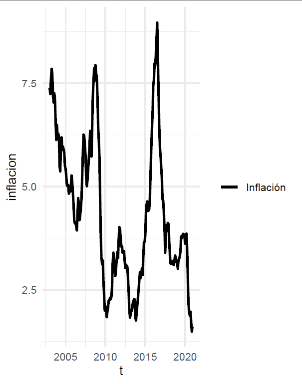
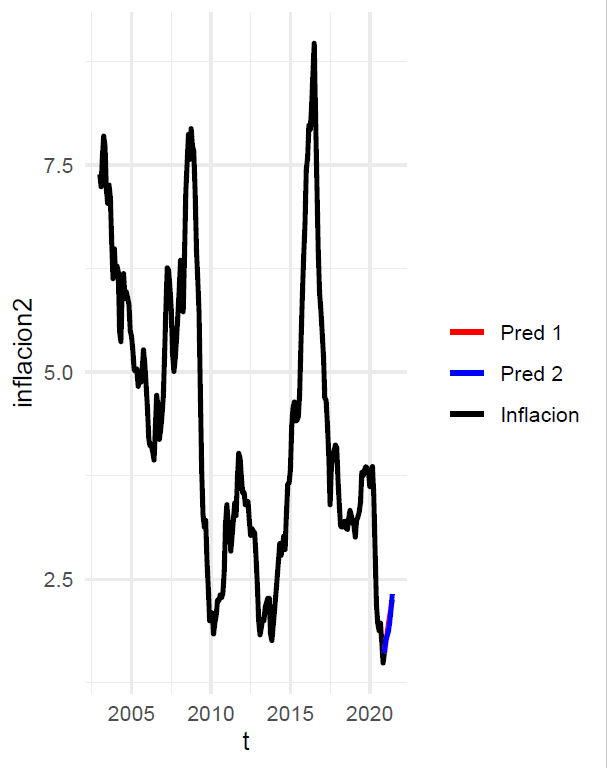
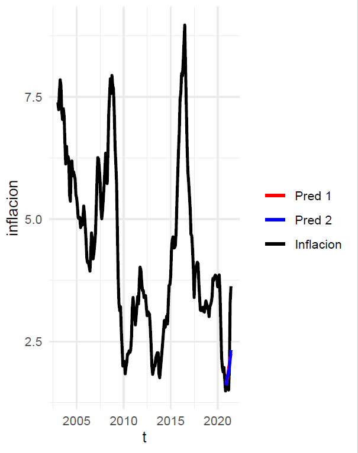

# La predicción en el área económica
    
# ¿Por qué hacer predicciones?

##

<ul>  
<li> Las series económicas y financieras no son deterministicas, por lo tanto existe incertidumbre sobre el futuro valor que estas pueden tomar.</li>
<li> Por lo tanto hacemos predicciones para la toma de decisiones, elegimos una opción entre diversas alternativas con el objetivo de maximizar la utilidad esperada.</li>
</ul>        

# 
  

Si queremos predecir la inflación. ¿Cómo podemos hacerlo?    

# Métodos posibles

##
Cualitativos;

<ul>
<li>Encuestas a expertos.</li>
<li> Actualización de expectativas.</li>
</ul>

Cuantitativos:

<ul>
<li>Descomposición.</li>
<li>Modelos univariantes.</li>
<li>Modelos multivariados uniecuacionales.</li>
<li>Modelos multivariados multiecuacionales.</li>
</ul>

##

En este curso nos enfocaremos en los modelos resaltados:

Cuantitativos:

<ul>
<li>Descomposición.</li>
<li>Modelos univariantes.</li>
<li>Modelos multivariados uniecuacionales.</li>
</ul>

#
  

Dos posibles predicciones basados en modelos Modelos multivariados uniecuacionales

#

  
Comparando con los datos reales claramente no hicieron un buen trabajo, ¿Cómo se puede mejorar?
