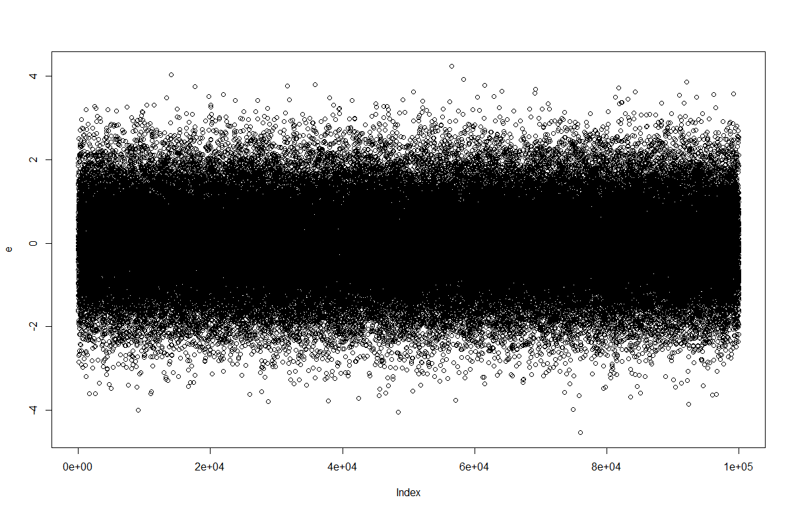
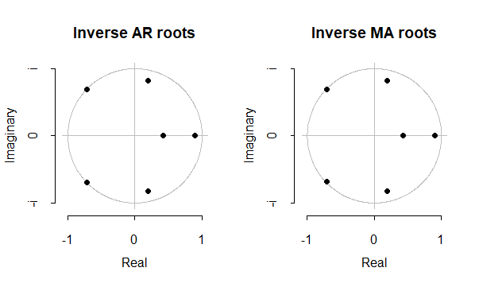

#

El objetivo de estimar estos modelos es encontrar el modelo más adecuado para la representación de la serie estudiada. Así, el modelo ideal debería cumplir con los siguientes requisitos:

<ul>
<li> Los residuales del modelo son ruido blanco.</li>
<li> El modelo es estacionario e invertible.</li>
<li> Los coeficientes son estadísticamente significativos y poco correlacionados entre si.</li>
<li> Los coeficientes de los modelos son suficientes para representar la serie.</li>
<li> El grado de ajuste es elevado en comparación con modelos alternativos.</li>
</ul>

# Ruido blanco

#

En el modelo ARIMA visto anteriormente, bajo una especificación correcta del modelo y si se conocieran los parámetros verdaderos se obtendría una serie de ruidos blanco $\varepsilon_1,\varepsilon_2,\dots,\varepsilon_T$,
\begin{equation}\label{eq:ep}
              \varepsilon_t = (1-\theta_1 L - \dots - \theta_q L^q)^{-1} (1-\phi_1 L - \dots - \phi_p L^p) (1 - L)^d x_t^{\lambda}   
\end{equation}

#

 Como vimos anteriormente los coeficientes de auto-correlación, $\hat{\rho}_j$, se distribuyen en muestras grandes,
 
\begin{equation}
\hat{\rho}_j \sim N\left( 0, \frac{1}{T} \right), \forall j
        \end{equation}

Por lo cual, si $\varepsilon_t$ es ruido blanco, se podría hacer la prueba, con el 5\% de significancia, $|\hat{\rho}_j \sqrt{T} | < 1.96$ 

#

El problema es entonces que $\varepsilon_t$ no es observable. Sustituyendo en la ecuación por los valores estimados de los parámetros, obtenemos $\hat{\varepsilon}_t$,
        
\begin{equation}
  \varepsilon_t = (1-\hat{\theta}_1 L - \dots - \hat{\theta}_q L^q)^{-1} (1-\hat{\phi}_1 L - \dots - \hat{\phi}_p L^p) (1 - L)^d x_t^{\lambda} 
        \end{equation}

Claramente, nuestros análisis tienen que hacerse sobre estos $\hat{\varepsilon}_t$.

#

Para que estos residuales estimados sean ruido blanco. los coeficientes de la FACE y FACPE no deben de ser estadísticamente significativamente diferentes de cero.

Con estos coeficientes podemos hacer un análisis de los coeficientes individuales o bien un contraste global de los residuales.

#

Para analizar estos coeficientes individuales necesitamos construir intervalos de confianza para los coeficientes de la FACE y FACPE.

Para esto, podríamos usar la varianza del $\hat{\rho}_j$ estimada anteriormente, $\frac{1}{T}$.

Sin embargo, esta varianza no constituye una buena aproximación para coeficientes de auto-correlación de residuos estimados.

#
Por ejemplo cuando se estima un AR(1) una aproximación más adecuada de esta varianza es,
        \begin{equation}
            Var(\hat{\rho}_j) \simeq \frac{1-\phi_1^{2j-2}(1-\phi_1^2)}{T} 
        \end{equation}

La diferencia entre esta aproximación y $\frac{1}{T}$ puede ser bastante elevada, especialmente en los coeficientes de orden bajo.

#
Para $j=1$ obtenemos,
        
\begin{equation}
 Var(\hat{\rho}_j) \simeq \frac{\phi_1^2)}{T} 
 \end{equation}

Suponiendo que $\phi=0.7$, obtenemos que la varianza es $\frac{0.49}{T}$ que es aproximadamente la mitad que la dada por $\frac{1}{T}$ 

#
En general, $\frac{1}{T}$ sobrestimara la varianza de los residuales. Por lo cual, no se rechazan que los coeficientes sean diferentes de cero en una mayor proporción que lo adecuado.

#

Otra forma de testear si los errores estimados, $\hat{\varepsilon}_t$, no tienen auto-correlación es el uso de contraste globales, o contrastes de ``Portmanteau''.

Para esto Box y Pierce (1970) propusieron el siguiente estadístico,
        \begin{equation}
            Q = T\sum_{j=1}^M \rho_j^2
        \end{equation}
        la hipótesis nula es,
        \begin{equation}
            H_0: \rho_1=\rho_2=\rho_3=\dots=\rho_M=0
        \end{equation}
        
#

Bajo la hipótesis nula Q se distribuye $\chi^2$ con M grados de libertad.

La elección de M es arbitraria, un M elevado tiene la ventaja que podemos testear por $\rho_j$ elevados. Pero, mientras más alto sea el M menor poder tiene el test, i.e. no rechaza la hipótesis nula cuando es falsa.

#

Por lo cual, Box y Pierce propusieron que para los $\hat{\varepsilon}_t$ de un ARMA(p,q) ycon un M suficientemente elevado la prueba se hago con una $\chi^2$ con M-p-q grados de libertad.

#

Finalmente, Ljung y Box (1978) propusieron una corrección para muestras pequeñas del estadístico Q,
        \begin{equation}
            Q^* = T*(T+2) \sum_{j=1}^M (T-j)^{-1} \rho_j^2 
        \end{equation}

que se distribuye como $\chi^2$ con M-p-q grados de libertad bajo la hipótesis nula de no auto-correlación de $\hat{\varepsilon}_t$

#

Otras pruebas un poco más informales sobre los residuales consisten en tomar primera diferencia de los $\hat{\varepsilon}_t$.

Así si la serie se aproxima a un ruido blanco, $\hat{\varepsilon}_t \simeq \varepsilon_t $, entonces
        \begin{equation}
            \Delta \hat{\varepsilon}_t = \varepsilon_t - \theta \varepsilon_{t-1}
        \end{equation}
        donde $\theta=1$.

Al calcular la FACE y la FACPE esperaríamos que se comporte como un MA(1)

#

El otro test informal que se puede hacer sobre los residuales es la gráfica de los residuales.

En este podemos ver posibles ``outliers'', observaciones anómalas que se encuentran alejadas del resto. Y que puede darse por choques exógenos sobre las variables.

Usualmente estás son definidas como $\left| \frac{\hat{\varepsilon}_t}{\hat{\sigma}_{\varepsilon}} \right| > 4$.

#

Cabe anotar que en muestras grandes la presencia de este tipo de outliers pueden darse por el hecho que la distribución normal permite este tipo de valores, e.g. en una muestra de 100.000 datos aproximadamente 3 datos serán considerados outliers.

En la gráfica de residuales también podemos observar si existe heteroscedasticidad, si la dispersión de los errores cambia a través del tiempo esto sería un claro indicio de heteroscedasticidad. 

#
 

#
 

# Estacionariedad y Estabilidad

#

Para comprobar si el modelo estimado es estacionario debemos factorizar el polinomio de la parte autorregresiva,
        \begin{equation}
            (1-\hat{\phi}_1 L-\hat{\phi}_2 L^2 - \dots - \hat{\phi}_p L^p) = (1-\hat{\lambda}_1 L)(1-\hat{\lambda}_2 L)\dots(1-\hat{\lambda}_p L)
        \end{equation}

Si existe un $\hat{\lambda}_i$ cercano a 1 es un indicio que el modelo es no estacionario.

#

Para comprobar si el modelo estimado es invertible se efectúa la factorización de las raíces MA,
        \begin{equation}
            (1-\hat{\theta}_1 L-\hat{\theta}_2 L^2 - \dots - \hat{\theta}_q L^q) = (1-\hat{\delta}_1)(1-\hat{\delta}_2)\dots(1-\hat{\delta}_q)
        \end{equation}

Si existe un $\hat{\delta}_i$ cercano a 1 es un indicio que el modelo es no invertible. En muchas ocasiones esto es señal que el modelo ha sido sobrediferenciado.

#

 

# Significancia y correlación

#

El tercer comportamiento deseable del modelo es que los coeficientes sean significativos y no correlacionados.
 
Esto es debido a que incluir parámetros no significativos aumenta la incertidumbre de la predicción del modelo.

#

También debemos ver la matriz de correlaciones entre los coeficientes estimados para detectar si existe un problema de multicolinealidad.

Si la correlación entre dos coeficientes es cercana 1 los coeficientes estimados serán inestables y por lo tanto pueden cambiar bastante de una realización a otra.

Así el modelo estimado puede diferir entre el periodo muestral y el periodo de predicción.    

#

Esto suele suceder cuando raíces de la parte AR y MA son cercanas, sea un modelo ARMA(p,q)
\begin{equation}
    (1-\lambda_1 L) (1-\lambda_2 L) \dots (1-\lambda_p L) w_t = (1-\delta_1 L) (1-\delta_2 L) \dots (1-\delta_q L) \varepsilon_t
\end{equation}

Si existen dos raíces iguales, digamos $\lambda_1 = \delta_q$ podemos expresar el proceso como un ARMA(p-1,q-1),
\begin{equation}
     (1-\lambda_2 L) \dots (1-\lambda_p L) w_t = (1-\delta_1 L) (1-\delta_2 L) \dots (1-\delta_{q-1} L) \varepsilon_t
\end{equation}

#

Cuando esto sucede si estimamos el modelo ARMA(p,q) en vez del modelo ARMA(p-1,q-1) los coeficientes son inestables debido a que sobre-estimamos el modelo y esto se vera reflejado en altas correlaciones de los coeficientes.

Otra razón por la cual los coeficientes pueden ser inestables es si las raíces están cercanas a 1, por lo cual las raíces del AR y MA también pueden dar indicios de no estacionariedad.

# Representación p.g.d

#

Para testear si los coeficientes del modelo son suficientes para representar el p.g.d. podemos usar pruebas de no linealidad.

Entre ellas la prueba de especificación de Ramsey y la prueba de redes neuronales de White para no-linealidad omitida son frecuentemente utilizadas.

#

La prueba del error de especificación de la ecuación de regresión o prueba RESET de Ramsey (1969) consiste en testear la hipotesis nula de,
\begin{equation}
    w_t = Z_t\beta + \varepsilon_t, \quad \varepsilon_t \sim IID(0,\sigma_{\varepsilon})
\end{equation}
donde $Z_t$ son los regresores que se consideran independientes del $\varepsilon_t$, contra la alternativa: $E[w_t | Z_t]$ es una combinación no lineal de $Z_t$

#

La forma más simple de hacer este test consiste en regresar $w_t$ contra $Z_t$ obtener los valores predichos $Z_T\hat{\beta}$ y correr la regresión,
\begin{equation}
    w_t = Z_t\beta + \delta(Z_T\hat{\beta})^2 + \varepsilon_t
\end{equation}

y se testea $\delta=0$.

Sin embargo, cuando tenemos componentes MA este test es bastante inestable ya que los $Z_t$ cambian entre la primera y la segunda regresión.  

#

La prueba de redes neuronales de White para no-linealidad omitida usa una red neuronal prealimentada de una sola capa. La prueba consiste en testear,
\begin{align}
    H_0: & E[\Psi_t \varepsilon^*_t] = 0 & H_a: & E[\Psi_t \varepsilon^*_t] \neq 0
\end{align}

donde $\Psi$ es una función no lineal y $\varepsilon^*_t$ son los residuos del modelo escogido.

##
 

#

El estadístico es de la forma, 
\begin{equation}
    M_n = \left( T^{-\frac{1}{2}} \sum_{t=1}^T \Psi_t \hat{\varepsilon}_t \right)' \hat{W}_n^{-1} \left( T^{-\frac{1}{2}} \sum_{t=1}^T \Psi_t \hat{\varepsilon}_t \right)
\end{equation}

donde $\hat{W}_n^{-1}$ es un estimador consistente de $W_n^{*} = var(\Psi_t \varepsilon^*_t)$.

Y se distribuye como $\chi^2$ asintóticamente.

# Bondad de ajuste

#

Finalmente, veamos los criterios para bondad del ajuste del modelo.

A diferencia de las pruebas que acabamos de ver, estos criterios se usan para escoger entre un posible conjunto de modelos.

Primero veremos criterios de selección basados en ajuste muestrales, una vez veamos predicción veremos criterios para selección basada en predicción.

#

Los criterios más utilizados y conocidos son el $R^2$ y $R^2$ ajustado, $\bar{R}^2$, si las adaptamos para un modelo estacionario ARMA(p,q) la formulación de estos criterios sería,
\begin{align}
        R^2 & = 1 - \frac{\hat{\sigma}_{\varepsilon}^2}{\hat{\sigma}_{w}^2} \\
        \bar{R}^2 & = 1 - \frac{\frac{\hat{\sigma}_{\varepsilon}^2}{T-p-q}}{\frac{\hat{\sigma}_{w}^2}{T-1}}
\end{align}

#

Sin embargo la aplicación de estos criterios en modelos ARIMA presenta ciertos inconvenientes.

Dado que el $R^2$ y $\bar{R}^2$ dependen de $\hat{\sigma}_{\varepsilon}^2$ y $\hat{\sigma}_{w}^2$ y esta ultima varianza depende del número de veces que se haya diferenciado, este estadístico solo tendrá validez cuando se comparen modelos con igual número de diferencias.

#

Para ver esto consideremos el siguiente modelo,
\begin{equation}
    (1-\phi L) x_t = \varepsilon_t
\end{equation}
con $\phi$ cercano a uno. Para este modelo tendríamos,
\begin{equation}
    \hat{\sigma}_{w}^2 = \frac{\hat{\sigma}_{\varepsilon}^2}{1 - \phi^2}
\end{equation}

#
Así el $R^2$ sería,
\begin{equation}
    R^2 = 1 - \frac{\hat{\sigma}_{\varepsilon}^2}{\frac{\hat{\sigma}_{\varepsilon}^2}{1 - \phi^2}} = \phi \simeq 1
\end{equation}

#

Si consideramos $w_t =  (1- L) x_t$, tenemos,
\begin{equation}
    (1-\phi L) \frac{w_t}{(1- L)} = \varepsilon_t
\end{equation}
por lo tanto podríamos escribir, $w_t \simeq \varepsilon_t$
Así, 
 \begin{equation}
    R^2 \simeq 1 - \frac{\hat{\sigma}_{\varepsilon}^2}{\hat{\sigma}_{\varepsilon}^2} \simeq 0
\end{equation}

#

Debido a estos problemas se han creado criterios de información para escoger modelos. El primer criterio es el criterio de información de Akaike (AIC).
\begin{equation}
    AIC = \ln \hat{\sigma}_{\varepsilon}^2 + \frac{2K}{T}
\end{equation}
donde K es el número de parámetros y se busca minimizar este criterio.

#

El segundo criterio es el criterio de información de Schwarz o criterio Bayesiano (BIC).
\begin{equation}
       BIC  = \ln \hat{\sigma}_{\varepsilon}^2 + \ln (T) \frac{K}{T} 
\end{equation}

donde K es el número de parámetros y se busca minimizar este criterio.

Como $\ln T > 2$ para $T>7$ este criterio siempre penaliza más que el AIC.

